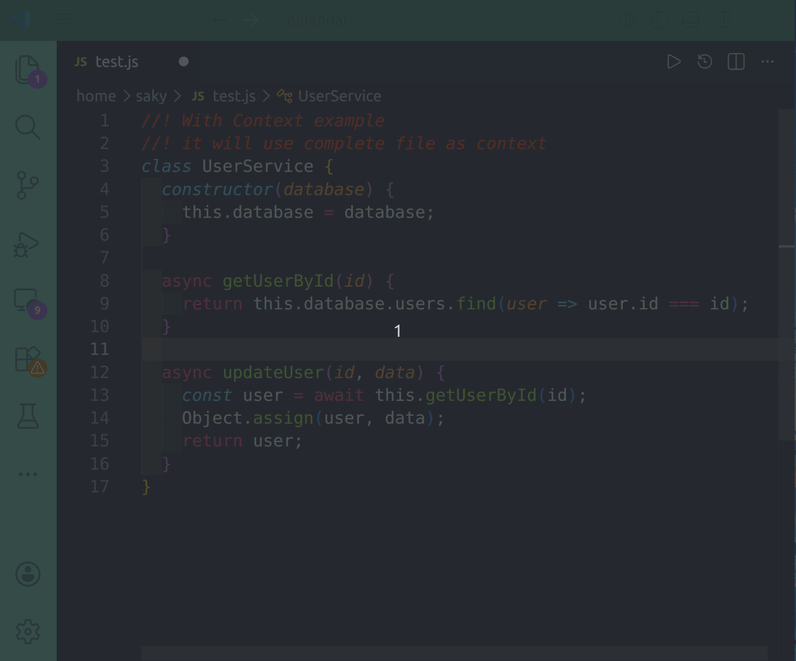
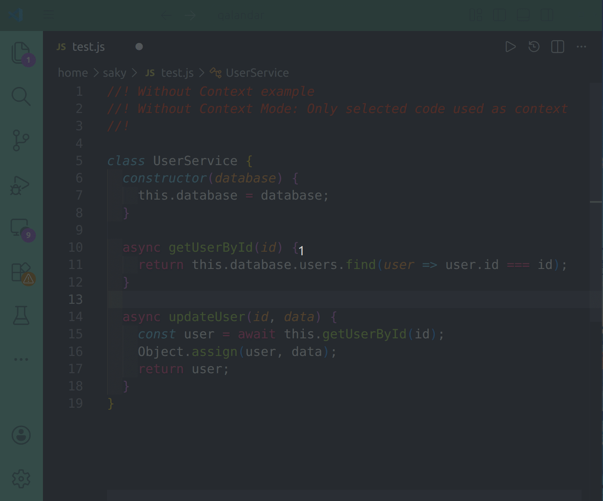

# Qalandar – AI Coding Assistant for Visual Studio Code

Qalandar is a lightweight AI-powered coding assistant that connects your local Ollama models directly to Visual Studio Code. Generate code, create snippets, and accelerate development without leaving your editor.

Unlike traditional AI assistants that focus heavily on explanations, Qalandar is designed for developers who want fast, practical code generation based on their prompts and existing code.

---

## Features

* 🚀 Generate code directly inside VS Code
* 🧠 Powered by your local Ollama models
* 🔒 Runs locally through Ollama for privacy and control
* ⚡ Two query modes for context-aware coding assistance
* 📝 Simple keyboard shortcuts for quick access

---

## Ask With Context



## Ask Without Context



## Getting Started

1. Install Ollama.
2. Run a supported model.

```bash
ollama run qwen2.5-coder:7b
```

3. Install the Qalandar extension.
4. Open a project in VS Code.
5. Press `Alt + F9` or `Shift + F9`.
6. Start generating code instantly.


## Query Modes

### Ask with Context (`Alt + F9`)

When using **Ask with Context**, Qalandar sends the entire content of your currently active editor file to the AI model as reference.

This allows the model to:

* Follow existing coding patterns
* Generate code that fits naturally into your current file
* Modify or extend existing implementations

Use this mode when the AI needs awareness of your current codebase.

---

### Ask without Context (`Shift + F9`)

When using **Ask without Context**, only your prompt or selected snippet is sent to the model. Without context provides faster response.

No active file content is included as reference.

This mode is ideal for:

* Generating standalone code snippets
* Asking generic programming questions
* Creating utilities, functions, or examples independent of your current file

---

## Keyboard Shortcuts

| Action              | Shortcut     |
| ------------------- | ------------ |
| Ask with Context    | `Alt + F9`   |
| Ask without Context | `Shift + F9` |

---

## Changing the Default Model


Qalandar is designed to work particularly well with **qwen2.5-coder:7b**, but you can use any Ollama-compatible coding model.

---


The extension uses:

```
qwen2.5-coder:7b
```

as the default model.

To use a different model:

1. Open **Extensions** in VS Code.
2. Search for **Qalandar**.
3. Click the **⚙ Settings** icon.
4. Locate the **Default Model** setting.
5. Replace the model name with your preferred Ollama model.
6. Restart VS Code.

Example:

```text
deepseek-coder:6.7b
```

or

```text
codellama:13b
```

Make sure the selected model is already installed in Ollama.

---

## How It Works

Qalandar acts as a bridge between Visual Studio Code and your local Ollama installation.

```text
VS Code → Qalandar → Ollama → Local AI Model
```

The quality, speed, and accuracy of responses depend largely on the model you choose. More capable models generally provide better code generation results.

---

## Privacy

Qalandar communicates only with your local Ollama instance. Your code remains on your machine and is processed by locally running AI models.

---

Happy coding with Qalandar! ✨
